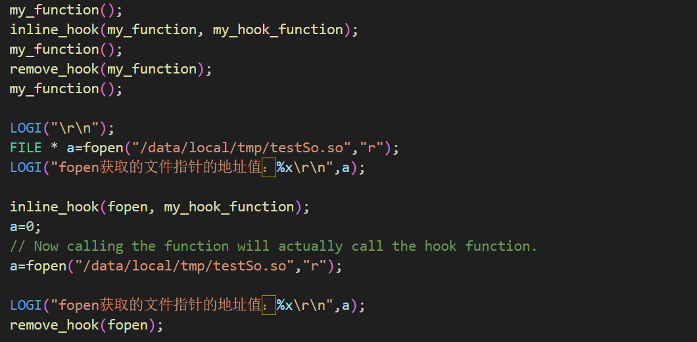
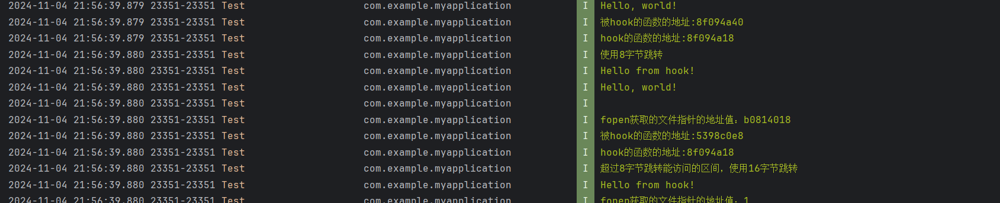

### 将hook代码编译成so用之前的注入器进行注入

### 测试代码

### LogCat显示

### 8字节实现inlineHook

计算被hook函数与hook函数的偏移，然后使用B指令覆盖被hook函数指令处

## 16字节实现inlineHook

 使用LDR X0, 8指令和BR X0指令，将被HOOK函数的绝对地址写在之后，X0被赋值为绝对地址，然后将上述指令覆盖在被hook函数指令处